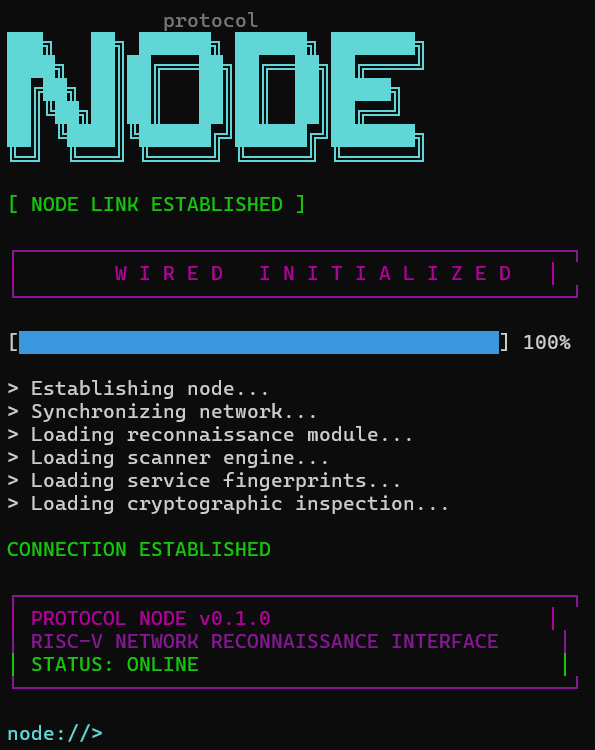
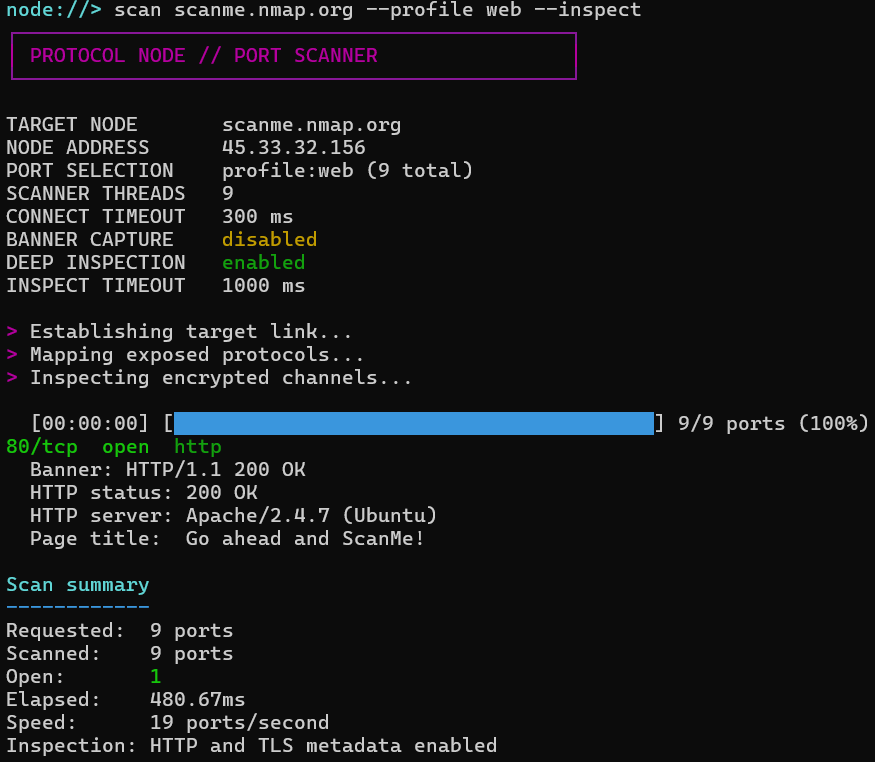

```text
             protocol

███╗   ██╗ ██████╗ ██████╗ ███████╗
████╗  ██║██╔═══██╗██╔══██╗██╔════╝
██╔██╗ ██║██║   ██║██║  ██║█████╗
██║╚██╗██║██║   ██║██║  ██║██╔══╝
██║ ╚████║╚██████╔╝██████╔╝███████╗
╚═╝  ╚═══╝ ╚═════╝ ╚═════╝ ╚══════╝
```
A multithreaded TCP port scanner written in Rust, with banner grabbing, HTTP enumeration, TLS cert inspection with additional pre-set profiles and JSON reporting. Apart of a future large security toolkit for RISC V systems.

## Boot Sequence



## Example Scan




